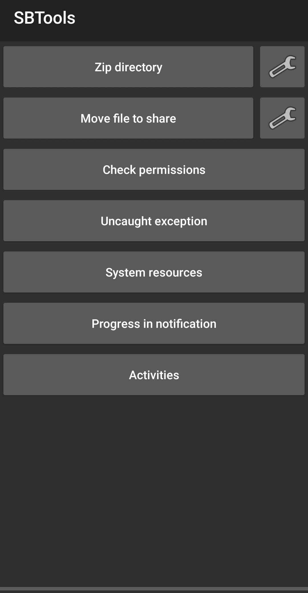
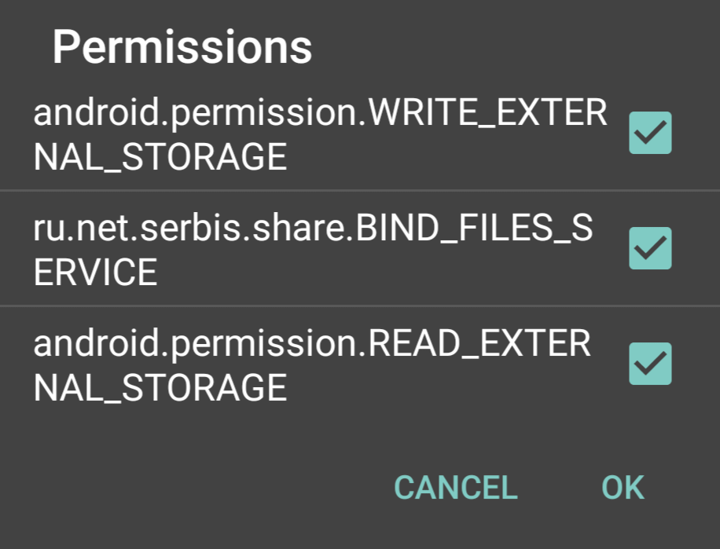
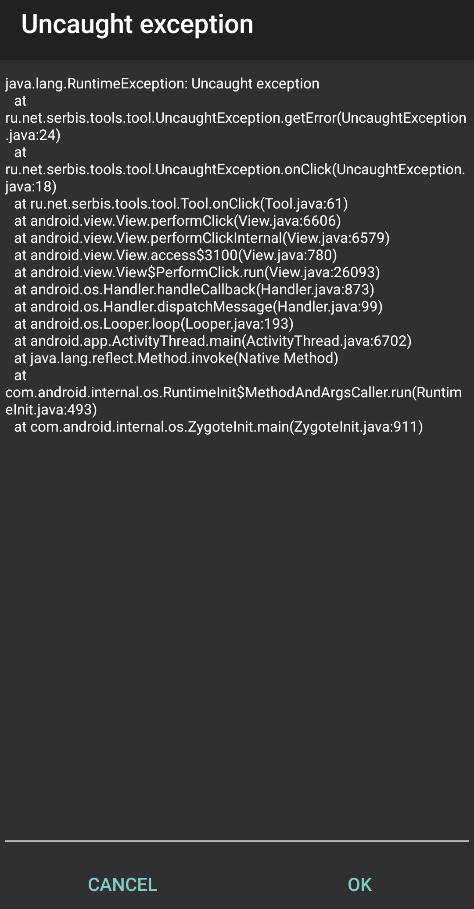
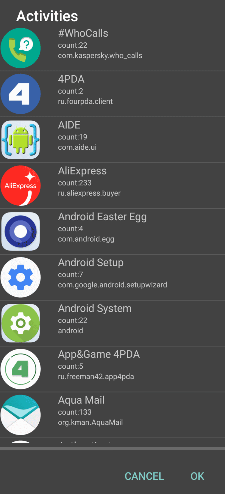
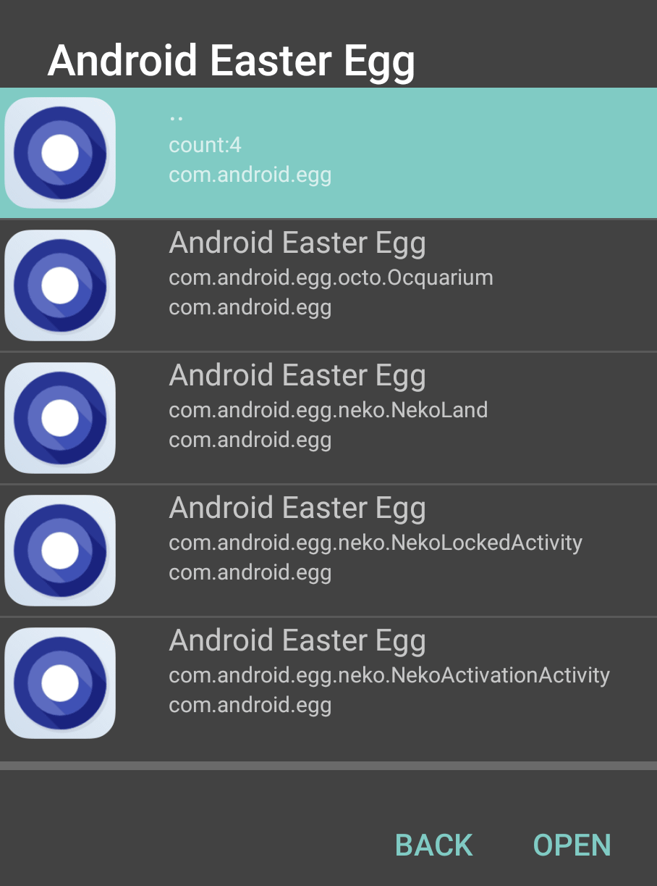
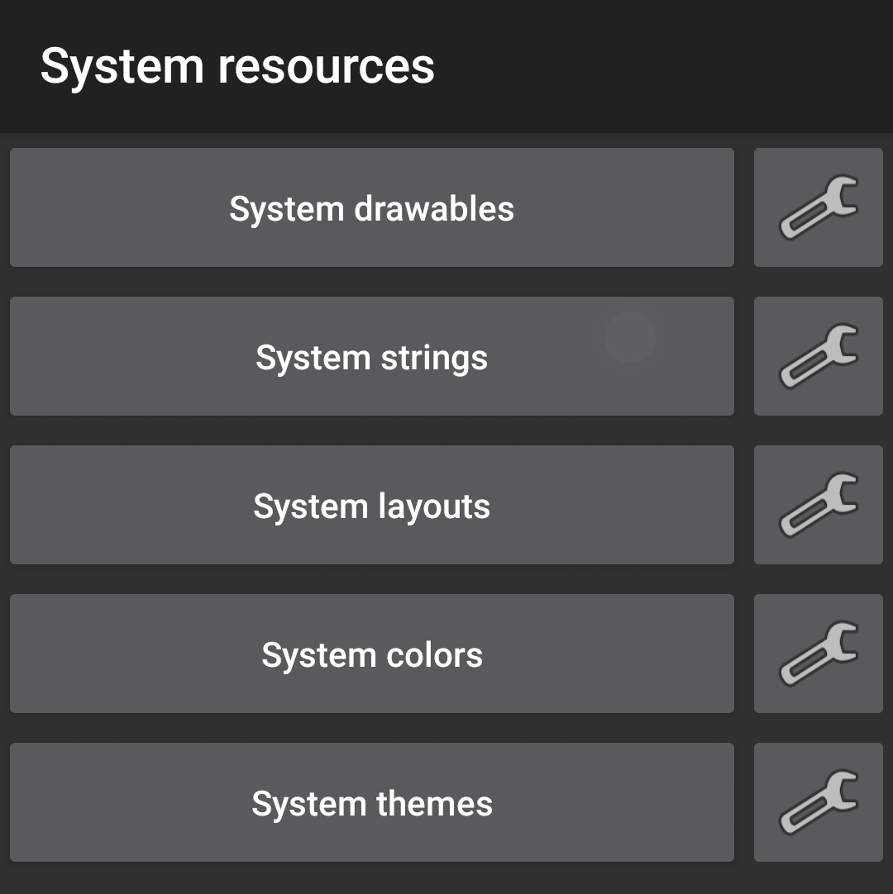
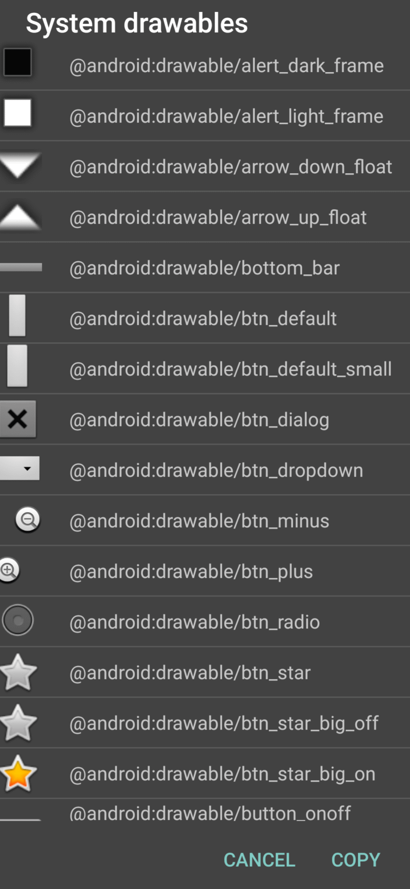
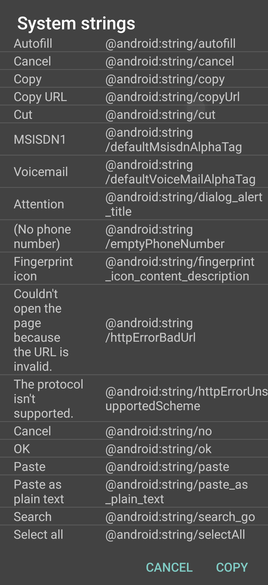
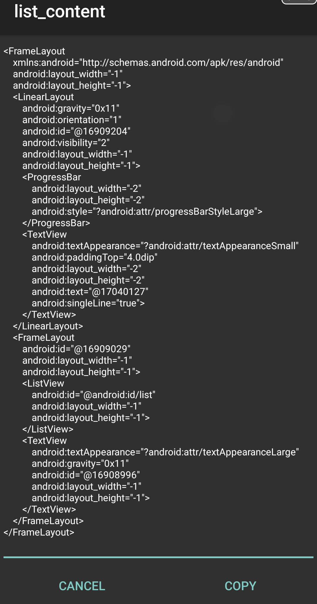
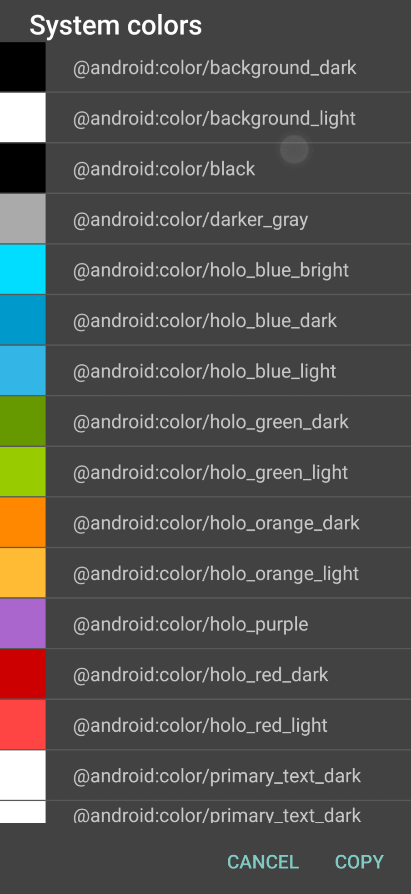

SBTools

- Main activity

  

  - Zip directory

    By settings button you can select the folder to zip and the result archive file. The tool button zips all files in the selected folder including subfolders and after zipping all source files will be deleled. On clicking tool button again tool adds new files to the existing archive.

  - Move file to share

    By settings button you can select the file on the phone and the share folder. For selecting and moving to the share folder it needs SBShareFolder application. After moving the file the tool removes it.

  - Check permission

    

    Dialog shows application's permissions. If some of them are not checked, you can check them and click OK

  - Uncaught exception

    

    The tool throws the exception for showing actvity with it and it's stack trace
 
  - System resources

    The tool opens the system resources activity

  - Progress in notification

    The tool creats a notification with the progress bar

    - Activities

    The tool show a list of applications which have activities. If click to any of them, tool open list of activities.

    

    

- System resources activity

  

  - System drawables

    

  - System strings

    

  - System layouts

    

    If you select some layout and click View button, the tool opens the viewer layout

    

  - System colors

    

  - System themes

    